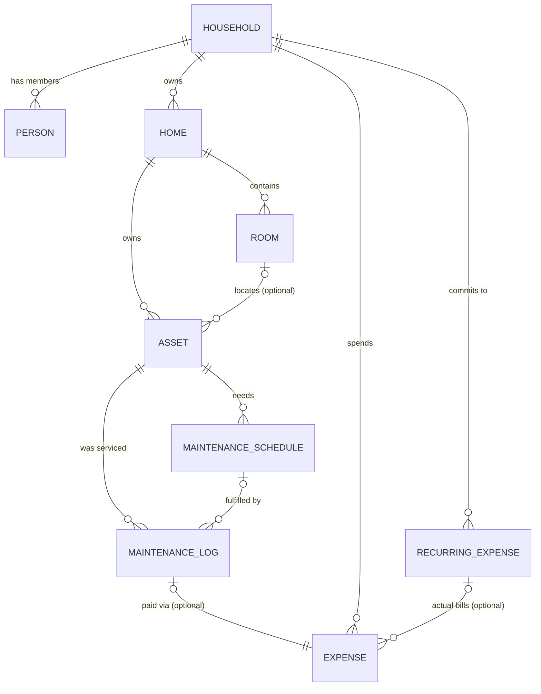

# Household OS — Ontology (Phase 1)

This document is the **binding definition of the Phase 1 data model**. If the database and this
document disagree, one of them is wrong and must be fixed. Any change to the data model starts
here (propose the change in this file first), then ships as a migration.

Written to be readable by a non-engineer. Field-level detail lives in the tables below; the SQL
in `supabase/migrations/` is the executable version of this document.

---

## The big picture

Phase 1 models the chain that CLAUDE home os.md calls the core thesis:

> a home owns assets → assets require maintenance → maintenance creates expenses → expenses drive forecasts

Plus two **universal** entities that can attach to almost anything: **Note** and **Attachment**
(see [Notes & attachments](#notes--attachments-the-memory-layer)).

Twelve tables total: `households`, `people`, `homes`, `rooms`, `assets`,
`maintenance_schedules`, `maintenance_logs`, `recurring_expenses`, `expenses`, `notes`,
`attachments`, and one read-only view `v_monthly_recurring_costs` for the dashboard.

---

## Conventions (apply to every table)

| Convention | Rule |
|---|---|
| Primary keys | `id uuid`, generated by the database (`gen_random_uuid()`) |
| Timestamps | Every table has `created_at` and `updated_at` (`timestamptz`); `updated_at` is maintained automatically by a trigger |
| Money | Always integer **cents**, stored as `bigint` (so a house price can never overflow). $1,234.56 = `123456`. Never floats, never dollars. |
| Dates | Real `date` / `timestamptz` columns, never strings |
| Category-style fields | Plain `text` with a `CHECK` constraint listing allowed values (not Postgres enums — a `CHECK` is trivial to change in a migration, enums are painful). Every list ends with `'other'` as the escape hatch. |
| Deletion | Deleting a parent cascades to things that only make sense under it (home → rooms/assets, asset → schedules/logs). Deleting a location or link target *detaches* rather than destroys (deleting a room sets the asset's room to empty). Deleting any entity automatically deletes its notes and attachment records. |
| Security | Row Level Security is ON for every table. The Phase 1 policy is simply "any signed-in user has full access" — the only two accounts are the family. See [Security model](#security-model). |

---

## Identity & container

### `households`
The root container. **One row** for this family. It exists so that every other table can hang off
it — which is also the seam where multi-tenancy would be added later, without redesign. We do not
build multi-tenant behavior now.

| Field | Type | Meaning |
|---|---|---|
| `name` | text | e.g. "The Ibrahim Household" |

### `people`
Household members. Two rows now (husband, wife). A person **may** be linked to a Supabase login
(`user_id`), but doesn't have to be — this leaves room for kids or others who exist in the data
but never log in.

| Field | Type | Meaning |
|---|---|---|
| `household_id` | → households | required |
| `user_id` | → auth.users | optional, unique; the Supabase login for this person |
| `name` | text | display name |

---

## Property

### `homes`
A physical property the family owns. Designed as a list (not a single row) because a second
property is plausible; the app can treat "one home" as the common case. The nullable descriptive
fields (`square_feet`, `year_built`, …) are the inputs Phase 3's cost-estimation heuristics will
want — capturing them now costs nothing.

| Field | Type | Meaning |
|---|---|---|
| `household_id` | → households | required |
| `name` | text | required, e.g. "Main house" |
| `address_line1/2`, `city`, `state`, `postal_code`, `country` | text | all optional |
| `purchase_date` | date | optional |
| `purchase_price_cents` | bigint | optional |
| `year_built` | int | optional |
| `square_feet` | int | optional |

### `rooms`
A named area inside a home. Purely organizational — it answers "where is this thing?".

| Field | Type | Meaning |
|---|---|---|
| `home_id` | → homes | required; deleting the home deletes its rooms |
| `name` | text | required, e.g. "Kitchen" |
| `floor` | text | optional, e.g. "2nd" |
| `description` | text | optional |

### `assets`
**The workhorse of Phase 1.** Anything the family owns that is worth tracking: appliances,
vehicles, HVAC systems, furniture, electronics — *and parts of the house itself*.

Two deliberate decisions (see `docs/decisions.md` for the full reasoning):

1. **One table for all asset kinds.** A vehicle and a dishwasher share 90% of their fields
   (name, purchase info, serial numbers, maintenance, receipts). Type-specific facts
   (VIN, mileage, HVAC tonnage) go in the free-form `details` field. If a kind of asset ever
   needs real structure (e.g. mileage-based maintenance), we promote those fields to columns then.
2. **House parts are assets.** "Gutters", "Roof", "Lawn", "Pool" are created as assets with
   category `system`. This means *every* maintenance schedule, service log, photo, and receipt
   hangs off an asset uniformly — there is no second way of doing maintenance.

| Field | Type | Meaning |
|---|---|---|
| `home_id` | → homes | required; every asset belongs to a home (vehicles included — they belong to the household's home base) |
| `room_id` | → rooms | optional; vehicles, gutters, and the lawn have no room. Deleting a room detaches its assets, it never deletes them. |
| `name` | text | required, e.g. "LG Refrigerator", "Honda Odyssey", "Gutters" |
| `category` | text | one of: `appliance`, `vehicle`, `system`, `furniture`, `electronics`, `other` |
| `manufacturer`, `model_number`, `serial_number` | text | optional |
| `purchase_date` | date | optional |
| `purchase_price_cents` | bigint | optional |
| `details` | jsonb | optional free-form facts, e.g. `{"vin": "…", "mileage": 42000}`. The maintenance knowledge pack (`src/lib/knowledge/`, ADR-010) also writes `subtype`, `dismissed_suggestions`, `replacement_year_override`, and `replacement_cost_cents_override` here — conventional keys, not schema. |
| `status` | text | `active` (default) or `disposed` — sold/trashed assets keep their history instead of being deleted |

---

## Operations

### `maintenance_schedules`
A recurring upkeep obligation on an asset: "replace HVAC filter every 3 months",
"clean gutters every 6 months". This is the *plan*; actual work done is a `maintenance_log`.

| Field | Type | Meaning |
|---|---|---|
| `asset_id` | → assets | required; deleting the asset deletes its schedules |
| `name` | text | required, e.g. "Replace air filter" |
| `description` | text | optional (filter size, how-to, etc.) |
| `interval_value` + `interval_unit` | int + text | e.g. `3` + `month`. Units: `day`, `week`, `month`, `year` |
| `next_due_on` | date | when it's next due. Phase 1: the app updates this when a log is recorded; the database doesn't do it automatically. |
| `estimated_cost_cents` | bigint | optional; lets the dashboard forecast maintenance cost before any money is spent |
| `is_active` | boolean | pause a schedule without deleting its history |

### `maintenance_logs`
A record that work actually happened — the asset's **service history**. Can fulfill a schedule
(`schedule_id` set) or be ad-hoc, like an unexpected repair (`schedule_id` empty).

If the work cost money, the app records an `expense` and links it here (`expense_id`). The money
lives *only* in the expenses table — the log points at it — so spending is never counted twice.

| Field | Type | Meaning |
|---|---|---|
| `asset_id` | → assets | required |
| `schedule_id` | → maintenance_schedules | optional; deleting a schedule keeps the logs (history survives) |
| `completed_on` | date | required |
| `cost_cents` | bigint | optional convenience copy for display; the authoritative money record is the linked expense |
| `performed_by` | text | optional free text, e.g. "ABC Plumbing", "me" (Vendors become a real entity in a later phase) |
| `expense_id` | → expenses | optional, one-to-one; the expense this service created |

### `recurring_expenses`
An **ongoing commitment**: mortgage, power bill, insurance premium, pest control contract.
This answers *"what does our life cost per month?"* — the heart of the Phase 1 dashboard.

Stored as the commitment's typical amount and cadence (e.g. `$220 / 1 month`). Optionally tied
to a home or an asset (car insurance → the car), which is what lets later phases answer
"what does this car really cost us?".

| Field | Type | Meaning |
|---|---|---|
| `household_id` | → households | required |
| `home_id` / `asset_id` | → homes / assets | both optional; attach the commitment to what it's for |
| `name` | text | required, e.g. "Electric bill" |
| `category` | text | one of: `mortgage`, `utility`, `insurance`, `tax`, `subscription`, `service`, `other` |
| `amount_cents` | bigint | typical amount per interval |
| `interval_value` + `interval_unit` | int + text | e.g. `1` + `month`, `6` + `month`, `1` + `year` |
| `starts_on` | date | required |
| `ends_on` | date | optional; a commitment with `ends_on` in the past no longer counts toward the monthly total |

### `expenses`
**Actual money spent** — a real, dated transaction. Three uses:

1. One-time purchases and repairs ("new dishwasher, $899").
2. The money side of a maintenance log.
3. *Optionally*, an actual bill for a recurring commitment ("July power bill: $241.17"),
   linked via `recurring_expense_id`. This is opt-in: the dashboard works from commitments alone,
   and logging actuals just makes it more accurate over time.

| Field | Type | Meaning |
|---|---|---|
| `household_id` | → households | required |
| `home_id` / `asset_id` | → homes / assets | both optional; attach spending to what it was for |
| `recurring_expense_id` | → recurring_expenses | optional; "this is the actual bill for that commitment" |
| `description` | text | required |
| `category` | text | the recurring list plus one-time kinds: `mortgage`, `utility`, `insurance`, `tax`, `subscription`, `service`, `maintenance`, `repair`, `purchase`, `other` |
| `amount_cents` | bigint | required |
| `incurred_on` | date | required |

### `v_monthly_recurring_costs` (view)
A read-only view (a saved query, not a table) that converts every **active** recurring expense to
a normalized monthly figure: yearly ÷ 12, weekly × 52 ÷ 12, and so on. The Phase 1 dashboard's
"your life costs $X/month" number is one `SELECT` against this view.

---

## Notes & attachments — the memory layer

Per the product vision, **every household object has memory**. Any entity above can carry
free-text notes and files (receipts, manuals, photos, contracts).

Both tables use the same pointer mechanism: instead of a fixed link to one table, each row stores
**which kind of entity** it belongs to (`entity_type`, e.g. `'assets'`) and **which row**
(`entity_id`). One notes table and one attachments table serve the entire system — no
per-entity duplication, and any entity added in a future phase joins the memory layer by adding
one word to a checklist.

The trade-off: Postgres can't enforce this kind of flexible pointer the way it enforces normal
links. We compensate inside the database itself:

- `entity_type` is CHECK-constrained to the real list of entity tables, so a typo can't create a
  note pointing at a table that doesn't exist.
- Every entity table has a delete trigger that removes its notes and attachment records when a
  row is deleted — **no orphans**, guaranteed by the database rather than by app code remembering
  to clean up.

### `notes`

| Field | Type | Meaning |
|---|---|---|
| `entity_type` | text | which table: `households`, `people`, `homes`, `rooms`, `assets`, `maintenance_schedules`, `maintenance_logs`, `recurring_expenses`, `expenses` |
| `entity_id` | uuid | which row in that table |
| `body` | text | the note itself |
| `created_by` | → people | optional; who wrote it |

### `attachments`
The **file itself** lives in Supabase Storage (a private bucket named `attachments`); this table
is the searchable index — what the file is, what it's attached to, where it lives.

| Field | Type | Meaning |
|---|---|---|
| `entity_type` / `entity_id` | text / uuid | same pointer mechanism as notes |
| `bucket` | text | storage bucket, defaults to `attachments` |
| `storage_path` | text | the file's path inside the bucket (unique per bucket) |
| `file_name` | text | original file name, e.g. `fridge-receipt.pdf` |
| `mime_type` | text | file kind, e.g. `application/pdf` |
| `size_bytes` | bigint | file size |
| `title` | text | optional human label, e.g. "Purchase receipt" |
| `kind` | text | what the file *is*: `receipt`, `manual`, `photo`, `warranty`, `contract`, `other` — this powers "show me all manuals" |
| `uploaded_by` | → people | optional |

> **One known gap, by design:** SQL can delete the attachment *row* but cannot delete the file in
> Storage. When the app implements deletion, it must remove the storage object too (or a periodic
> cleanup can sweep unreferenced files). Recorded in `docs/decisions.md`.

---

## Security model

- Row Level Security (RLS) is enabled on **every** table from day one, so nothing is ever
  accidentally public.
- The Phase 1 policy on every table is: **any authenticated user has full access**. The only two
  accounts that exist are the husband and wife, and they share everything.
- The `attachments` storage bucket is **private**; only authenticated users can read or write
  files, and only through the app.
- `household_id` columns exist on the top-level tables purely as the future seam: if
  multi-tenancy ever happens, policies tighten from "any signed-in user" to "member of this
  household" without a schema redesign. We are explicitly **not** building that now.

---

## What Phase 1 deliberately does NOT model

Per the phased-scope rule ("do not build ahead of the current phase"):

- **Warranties, insurance policies, subscriptions, utilities as first-class entities** — Phase 2.
  For now: a warranty PDF is an attachment with `kind = 'warranty'`; a subscription is a
  `recurring_expense` with category `subscription`.
- **Vendors** — free text in `maintenance_logs.performed_by` for now.
- **Tasks, projects, documents search, scenario modeling** — Phase 3.
- **Meals, recipes, travel, shopping** — later.
- **Auto-generation of expenses from recurring commitments, or auto-advancing `next_due_on`** —
  application behavior, decided when the app is built; the schema supports either choice.
